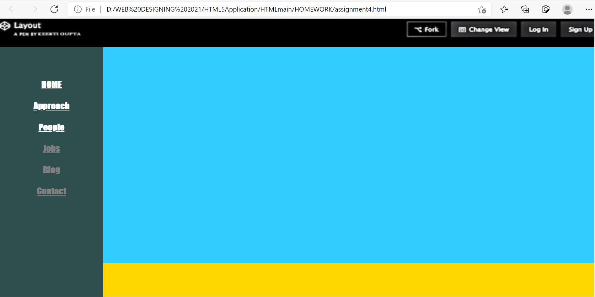
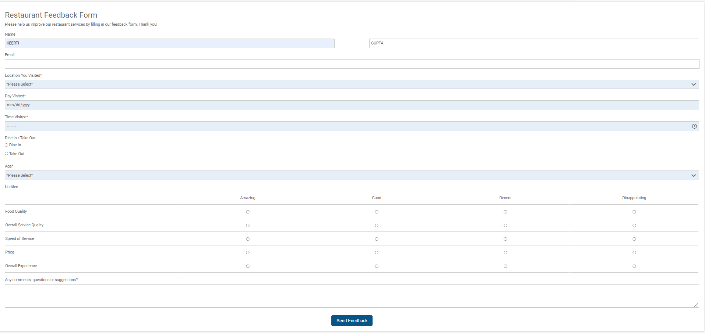
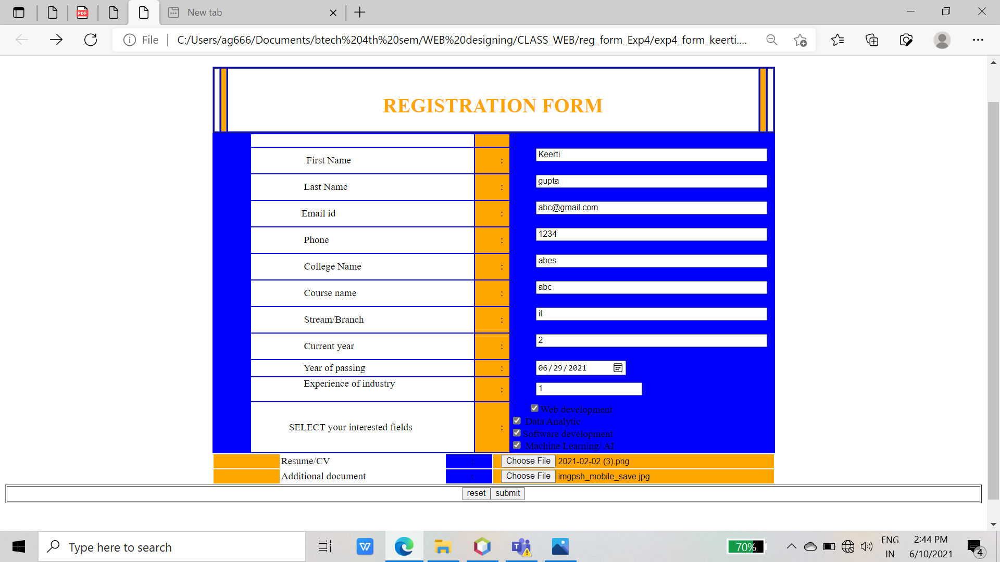
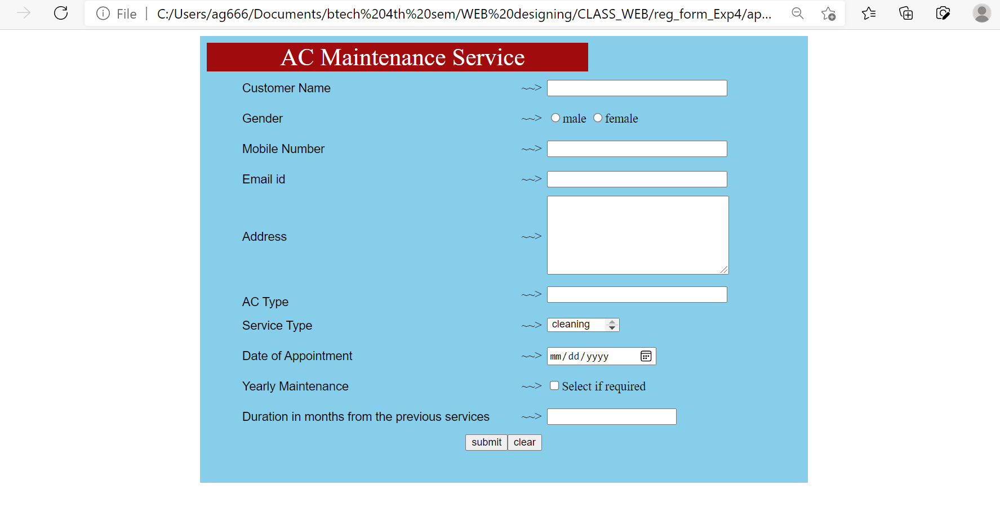

# WEB-DESIGNING
 practicing  and Creating sample small websites using  HTML5 css and js
 
 
 
 
Following webpages  are design 

1.layout1website

 

2.Restaurantfeedbackform

3.Registrationform

4.Maintenance form 

